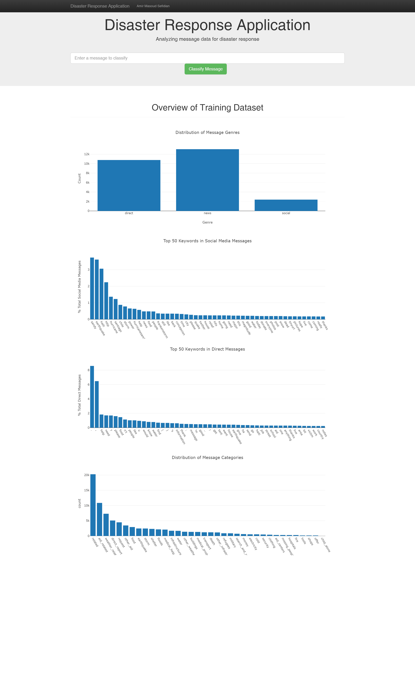
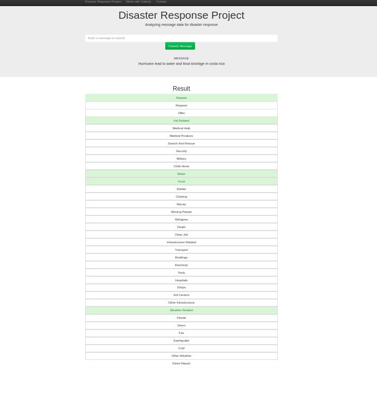

# Disaster Response Pipeline on Figure Eight data

## Project Overview

 
Machine learning is critical to helping different organizations understand which messages are relevant to them and which messages to prioritize. During these disasters is when they have the least capacity to filter out messages that matter, and find basic methods such as using key word searches to provide trivial results. 


In this project, I will analyze thousands of real messages provided by Figure 8, sent during natural disasters either via social media or directly to disaster response organizations. We'll build an ETL pipeline that processes message and category data from .csv files and load them into a SQLite database, which our machine learning and NLP pipelines will then read from to create and save a multi-output supervised learning model. The project will also include a Flask-based web app integrated with Plotly Dashboards. It extracts data from this database to provide data visualizations and uses the trained model to classify new messages for 36 categories (Multi-Label Classification problem). An emergency worker can input a new message and get classification results in several categories. The web app will also display visualizations of the data.


## Preparing the environment
**Note**: I have developed this project on __Linux__. It can surely be run on Windows and Mac with some little changes.

1. Clone the repository, and navigate to the downloaded folder.
```
git clone https://github.com/iamirmasoud/disaster-response-app.git
cd disaster-response-app
```

2. Create (and activate) a new environment, named `disaster_env` with Python 3.7. If prompted to proceed with the install `(Proceed [y]/n)` type y.

	```shell
	conda create -n disaster_env python=3.7
	source activate disaster_env
	```
	
	At this point your command line should look something like: `(disaster_env) <User>:disaster-response-app <user>$`. The `(disaster_env)` indicates that your environment has been activated, and you can proceed with further package installations.

6. Before you can experiment with the code, you'll have to make sure that you have all the libraries and dependencies required to support this project. You will mainly need Python3.7+, PyTorch and its torchvision, OpenCV, Matplotlib. You can install  dependencies using:
```
pip install -r requirements.txt
```

7. Navigate back to the repo. (Also, your source environment should still be activated at this point.)
```shell
cd disaster-response-app
```

8. Open the directory of notebooks, using the below command. You'll see all the project files appear in your local environment; open the first notebook and follow the instructions.
```shell
jupyter notebook
```

9. Once you open any of the project notebooks, make sure you are in the correct `disaster_env` environment by clicking `Kernel > Change Kernel > disaster_env`.


## Files Descriptions
The project contains the following files,

*  [1_ETL_Pipeline Notebook](1_ETL_Pipeline.ipynb): Notebook experiment for the ETL pipelines
* [2_ML_Pipeline Notebook](2_ML_Pipeline.ipynb): Notebook experiment for creating and evaluating the Machine Learning and NLP pipelines.
* [process_data.py](process_data.py): The ETL pipeline used to process data in preparation for model building.
* [train_classifier.py](train_classifier.py): The Machine Learning pipeline used to fit, tune, evaluate, and export the model to a Python pickle (pickle is not uploaded to the repo due to size constraints on Github).
* __app__ directory: Flask application folder. `run.py` starts the python server for the web app and prepare visualizations.


## Usage:

1. Run the following commands in the project's root directory to set up your database and model.

* To run ETL pipeline that cleans data and stores in SQLite database:

```shell
python ./process_data.py data/disaster_messages.csv data/disaster_categories.csv data/DisasterResponse.db
```

* To run ML pipeline that trains classifier and saves the model:

```shell
python ./train_classifier.py data/DisasterResponse.db models/classifier_me.pkl
```

2. Run the following command in the app's directory to run your web app:
    `python run.py`

3. Go to http://127.0.0.1:3001 to check out the API.




## Examples
Here are some examples of message classification:

Type in: `We have a lot of problem at Delma 75 Avenue Albert Jode, those people need water and food.`
in the text box and click `Classify Message`.


More examples:



*Note:* This project is part of Udacity [Data Scientist Nanodegree Program](https://www.udacity.com/course/data-scientist-nanodegree--nd025).
